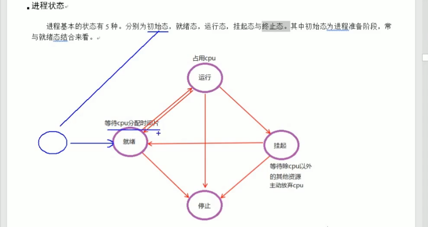

## 并发：
宏观：用户体验上，程序在并行执行
微观：多个计划任务，顺序执行，在飞快的切换，轮换使用cpu时间片

进程并发：
    程序：编译成功得到的二进制文件，可以执行
    进程：运行起来程序，占用系统资源（内存，cpu，文件句柄等）
进程的状态：
    1. 就绪：等待cpu
    2. 运行：正在执行
    3. 阻塞：等待系统资源，如等待键盘输入，等待文件读
    4. 睡眠：等待时间，如定时器，定时器触发后
    5. 停止：程序异常退出，如异常，异常退出

操作系统：
    32位： 2的32次方 内存地址的存储的上限是4G
    64位： 2的64次方 内存地址的存储的上限是xxTB

进程：
进程什么都不干，只给线程提供运行环境，线程才是真正干活的
线程： 线程运行在进程内，进程内可以有多个线程，线程之间是共享进程的资源

互斥量：（mutex）
读写锁：（rwlock）

线程同步机制：

协程并发：轻量级的线程

进程是分配资源的，线程是最小执行单位
协程是为了提供程序执行效率，线程是为了提供资源分配效率

channel：
    是一种数据类型，用于携程通信，可以传递任意类型数据，包括结构体，数组，字符串，整型，浮点型，布尔值，指针，函数，函数指针

